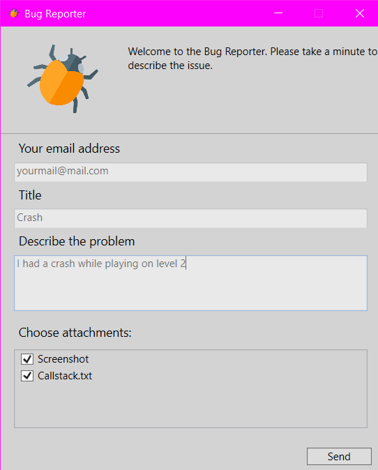

# BugsReporter

BugsReporter is a tool which allows your user to report an issue with your application.

Project contains 3 modules:
- Server - that's where user's information is sent
- Client - allows you to sent an information about an issue to server
- ClientView - it's basically the version of Client module with UI for an user

As a developer you have 2 options to send an information about an issue:
- implicitly - you provide all data which is sent to server. You can, for instance attach a callstack or screenshot (BugsReporter is able to capture a screenshot). User is not aware of that.
- explicitly - you can provide data like files to attach, but user is able to exclude some or all of them.

